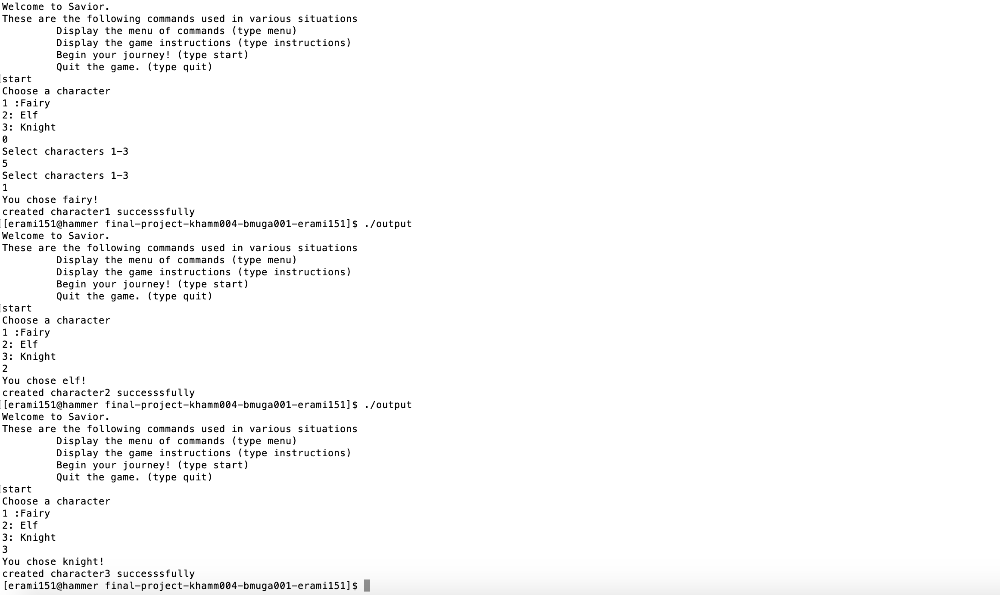

# Survivor

  > Authors: [Bijal Mugatwala](https://github.com/bijalm), [Kathyrn Hammar](https://github.com/khamm004), [Estela Ramirez Ramirez](https://github.com/estela-ramirez)

## Project Description
 > Savior is a text based Role-Playing Game. Users will be able to choose a character, make decisions and work through riddles in order to progress through the whole story. Different decisions will lead to different story outcomes. 

### Inputs/Outputs
 > It will be implemented in C++. We are interested in creating Savior because it allows room for creativity and the end product will be unique and fun to share with others. The input would be different choices that the user would want to make. The output would be text responses and indicators to represent the varied paths of the story and the possible actions of the character based on the decision of the user.
 >
 > Example: 
 >  * *Conversation*
 >     * Output: “Hello traveller, welcome, here is a book to assist you on your journey.”
 >     * Input: a. “What is inside this book?” b. “Thanks, see ya.”
 >  * *Action*
 >    * Output: “A fairy has stolen your book!”
 >    * Input: a. Chase fairy b. Let it get away c. Shoot it with arrow
 >
 > Each option resulting in a different resulting story line.

### Strategy Design Pattern
> An important feature of our game is that characters have different attacks and each attack has a different algorithm associated with it. We anticipate that we will continuously have to override the attack method per character class in order to give each character a distinct attack. Additionally, in the case that an attack algorithm changes, the client (character class) will also have to change. In order to resolve this issue, we will implement the Strategy Pattern. The Strategy Pattern will allow us to separate the different algorithms for the attacks from the client (character classes). This will allow the corresponding algorithm to be called during runtime when the user selects an attack. 

### Abstract Factory Pattern
> Another important feature of our game is the ability to mix and match characters with different weapons and armor. In trying to implement this feature, we face the challenge of reserving certain weapons and armor for a particular type of character. In order to resolve this issue, we will implement the Abstract Factory Pattern. This pattern will be used to help create new character instances with the user’s choice of weapon and armor. For example, if our game included some sort of soldier, then it would be very easy to be able to create a new instance of a character with properties like strength and carries armour. Additionally, it prevents characters from being matched with weapons and armor that do not make sense. 

## Class Diagram
  ### Abstract Factory Pattern Diagram 
  >
  > ## Character Factory OMT Description:
  > In our game, the different characters are distinguishable by their weapon and defense. For example, the Knight has a designated knight weapon (sword) and defense (shield). When the user wants to select a new character, if they select a Knight, the knight object will be used as the user’s character. If instead, the user decides to select the Fairy character, that will take the place of the user character.
  ### Strategy Pattern Diagram
  >
  > ## Strategy Pattern OMT Diagram Description
  > This game will utilize the strategy design pattern in order to implement the separate algorithms necessary for attacking. These methods are different for each character type so the strategy pattern enables them to be implemented independently but uniformly through a predefined interface (called Attack).  
 
 ## Screenshots
 > Screenshots of the input/output after running your application
 ## Installation/Usage
 > clone repository
 > 
 > run the following commands
 > cmake3  .
 > make
 > ./main
 
 > or run
 > g++ -g -O0 -o main src/main.cpp sr/character.cpp
 > 
 ## Testing
 > In order to test our project, we used the Google Test Framework to unit test our code. For aspects that require user input, we tested it on the terminal. Screenshots are provided below.
 > 
 >
 >
 >
